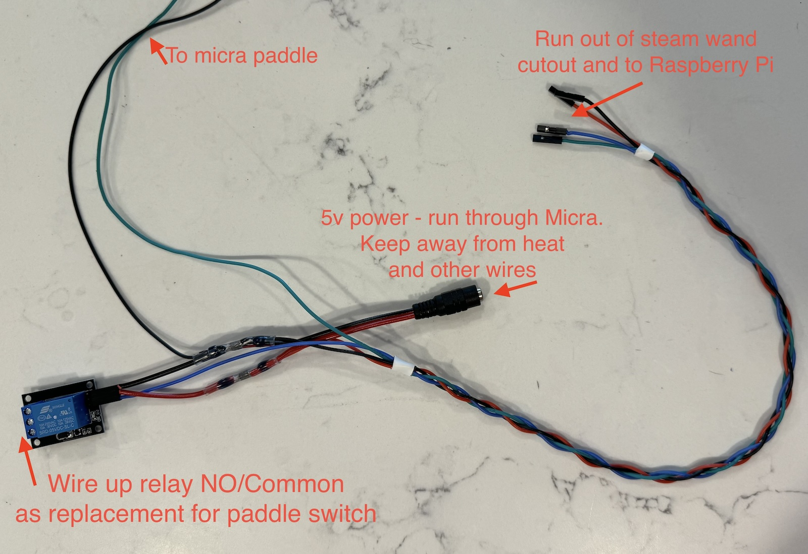
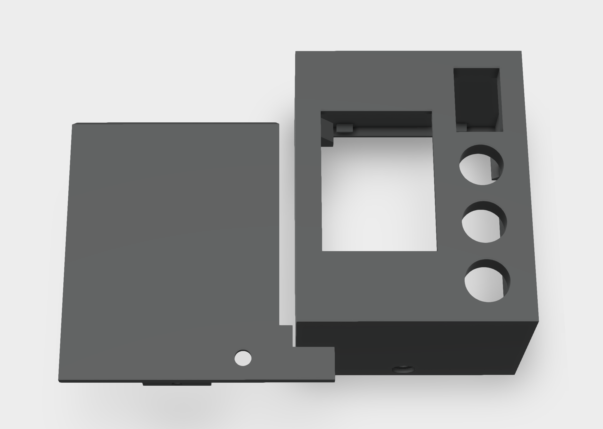
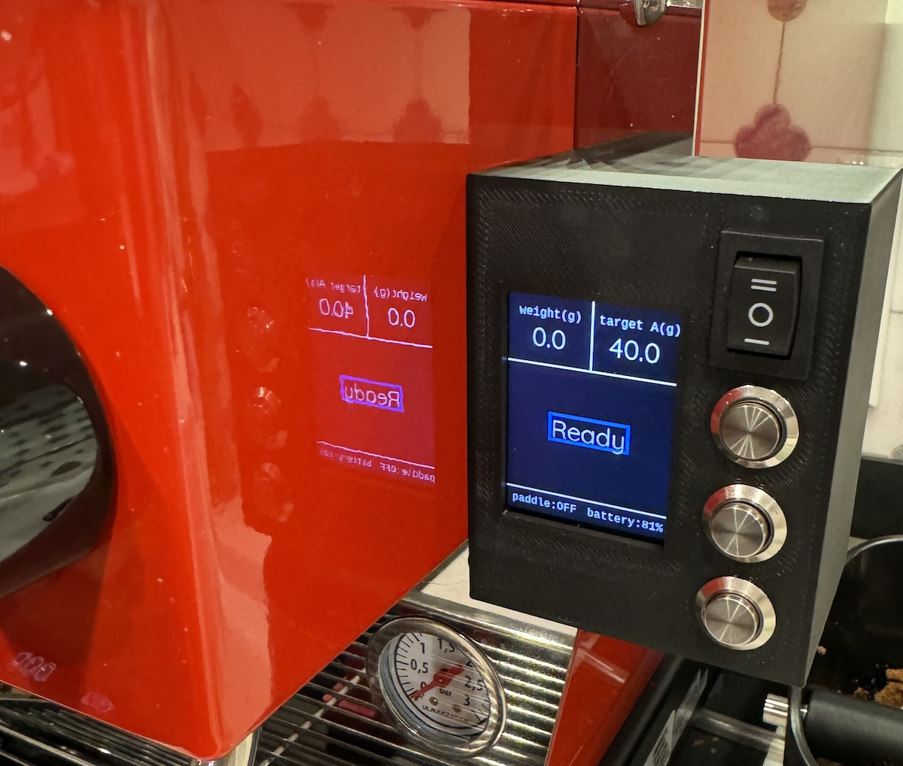
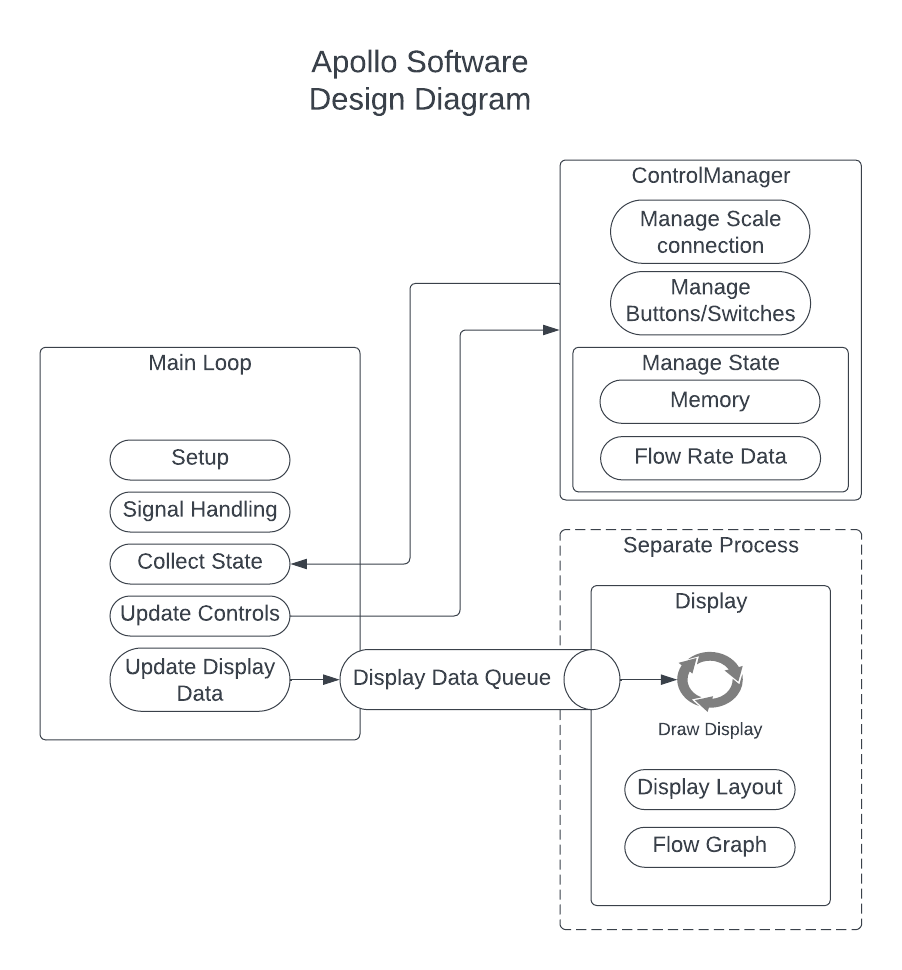

# Apollo for LM Micra/Acaia Lunar

Apollo helps land espresso on your Lunar scale. This project adds brew-by-weight and a small controller 
for La Marzocco Micra with Acaia Lunar. It may also work with other Acaia Bluetooth scales like Pyxis. 

This project is more about scale integration than Micra integration. It cannot do flow profiling or other advanced 
control over the Micra, it is simply collecting data from the scale and acting as a proxy for the paddle switch.

**This is a hobby project, as such there is no support.** It is sort of a hack/proof of concept being beaten into shape.
Contributions are welcome, though this is very much designed to work according to my needs, for customization I'd 
suggest forking and making it your own.

## Hardware

### Materials

Note that where external links are provided, they may not age well.

* A Raspberry Pi Zero 2 W w/soldered header
* 5v relay w/3.3v compatible logic control
* 5v 2a power supply
* 2.1mm barrel jack connector/wiring harness
* pushbutton switch x 2
* toggle switch
* up/down rocker switch (or two pushbutton switches)
* 2" WaveShare 240x320 SPI display (or compatible)
* Screws - M2.0, M2.5 4mm length, or #3-24 in 1/4" length depending on your 3d printer tolerances
* Silicone 24AWG hook up wire
* Soldering tool and/or 2.54mm crimping set
* 3d printed enclosure, or self-provided alternative

### Controller

A Raspberry Pi was selected to accommodate easy adoption of existing Python libraries without having to
rework them to function on a microcontroller.  Ultimately this is more flexible in terms of expanding
functionality as well.

### Display

The software should support either the [WaveShare 2.0" display](https://www.waveshare.com/2inch-lcd-module.htm) 
or the [2.4" display](https://www.waveshare.com/2.4inch-lcd-module.htm). The 2.4" display seems to have worse
viewing angles and is less sharp, and display_size needs to be updated in `main()`. **For compatibility with the included enclosure, the 2" display should be used.**

### Relay

There isn't one specific relay to link to. Any 5v Arduino/Pi/ESP32 type relay should work. It will have 
common/NC/NO connections on the relay side and 5v/gnd/control pin on the controller side.

### Buttons

I use a momentary pushbutton switch for the tare and memory buttons, a toggle switch for the "target enable" button,
and an up/down rocker switch for adjusting the target. The up/down rocker switch can be thought of as two momentary
switches with a common ground - you can use two separate buttons as well.

For compatibility with the included 3d printed enclosure, the buttons should be 12mm. The rocker switch should be
rectangular and support 19mm x 13mm opening. 

I found the quality of rocker switches a bit difficult, some had significant bounce leading to them being a bit tricky 
to use. I bought several kinds and used what worked best. The model I ended up using was `MXU1-2-123`.

### Wiring

I bought a crimping tool in order to finish off the connections with standard Dupont 2.54mm connectors for easy
wiring up to the Raspberry Pi header.


To simplify the wiring of power and controls between the Micra and the controller, I created a custom harness. This 
keeps the ground and power connections for the relay and switches in the Micra, with just 5v,ground and one wire
per IO going back to the controller (4 pins total).



The Micra paddle is accessible by removing the top four screws above the group head. Here, you would find a wiring
bundle containing black and white wires connecting to the paddle. These have bullet connectors which can be 
disconnected. You can insert the relay and Pi into this circuit to read the paddle state and control the Micra (or 
perhaps another device).


### Enclosure

The enclosure STL file can be found [here](doc/Apollo_2inch_v2.stl). It may need fine tuning, depending on the accuracy
and tolerances of your printer.



Looking from the inside, the display mounts with four screws to the far side, along with the buttons.


The Raspberry Pi mounts above the display, using the standoffs on the right. There are only two mounts for the Pi. 


In all cases be careful not to over-tighten. Ensure everything is connected properly. Route the wiring for the 
paddle/power through the cutout and then up into the group area through the open hole by the steam wand.

The backplate is designed to mount to the Micra on the right of the machine, using the large screw hole. Optional 8mm
magnets can be placed to aid installation and help secure the top of the plate.


Then the enclosure hangs on the plate from the top clamshell-style. Once hung, a screw can be inserted to fasten the 
bottom of the enclosure to the plate.



## Software Installation

It is assumed you have a Raspberry Pi Debian distribution already installed. As of this writing,
Debian Bullseye is the recommended OS for the Pi Zero 2W. Other versions of Raspberry Pi may also
work.

### Display Driver

The SPI bus must be enabled to drive this display. Log into your Pi and run the following:

```commandline
sudo raspi-config
```
Choose Interfacing Options -> SPI -> Yes  to enable the SPI interface

Next, we want to release memory from the GPU for system use. Still in `raspi-config`, under Performance -> GPU Memory limit 
set to 16M.

Finally, we want to disable the login UI. Under System Options -> Boot / Auto Login choose "Console" 

```commandline
sudo reboot
```

### Software dependencies

```commandline
sudo apt install python3-pandas python3-pip libglib2.0-dev git
sudo pip3 install bluepy
```

#### Apollo Software
TODO: DEB package or install script

```commandline
git clone https://github.com/mlsorensen/apollo.git
cd apollo
sudo mkdir -p /opt/apollo/web
sudo cp -r apollo.py lib /opt/apollo
sudo chmod +x /opt/apollo/apollo.py
sudo cp service/apollo.service /etc/systemd/system
sudo cp service/env /etc/default/apollo
sudo systemctl daemon-reload
sudo systemctl enable --now apollo
```

By default, the software scans for any Lunar device in the vicinity and connects to it. There is no simple
way to set a specific scale MAC address yet.

## Software Development



### ControlManager

This controls the physical devices. It defines buttons, keeps state, and maintains scale connectivity.

### Display

Display class is responsible for defining how graphics are drawn, and updating the physical display as well as saving
images of finished shots. It runs in a separate process so that display refreshes aren't blocked on anything else. To
achieve this, current data is pushed onto a queue which is constantly read from - the queue is drained on each
refresh and the latest data is displayed.

This was originally using matplotlib, which was CPU intensive and slow. Several other libraries were investigated, but 
they all had their own drawbacks (dependencies), optimization for webpage viewing, performance etc. In the end it was 
decided drawing the graph using simple lines was sufficient and performant.

### Main loop

The main loop is responsible for basic logic of setting up a Display and ControlManager, then orchestrating data
collection and state updates.

### Display

A single frame can be generated using `test_display.py` for design changes to the display. Running `pytest` should be
sufficient to discover this test, run it, and open the resulting image on your workstation.