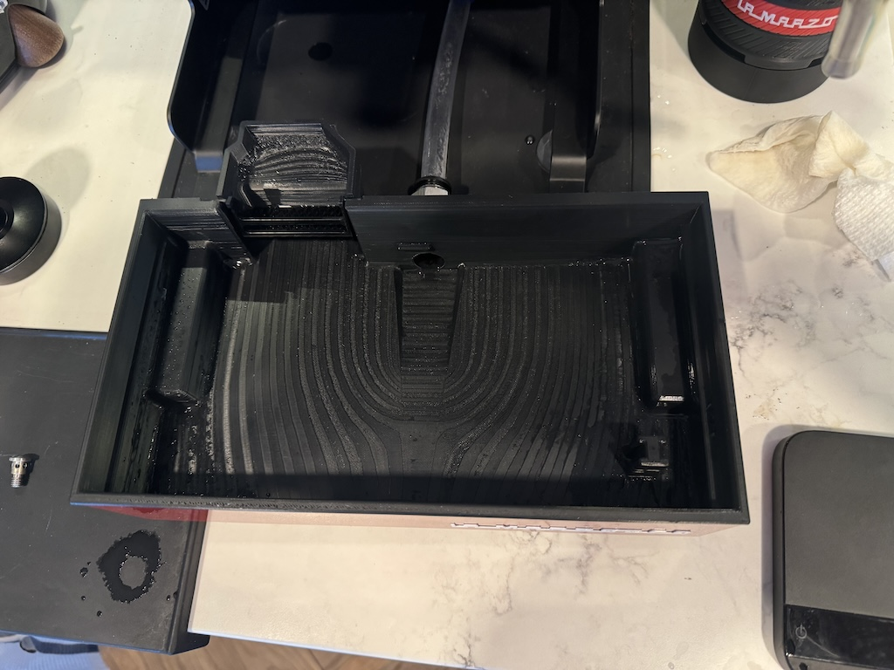
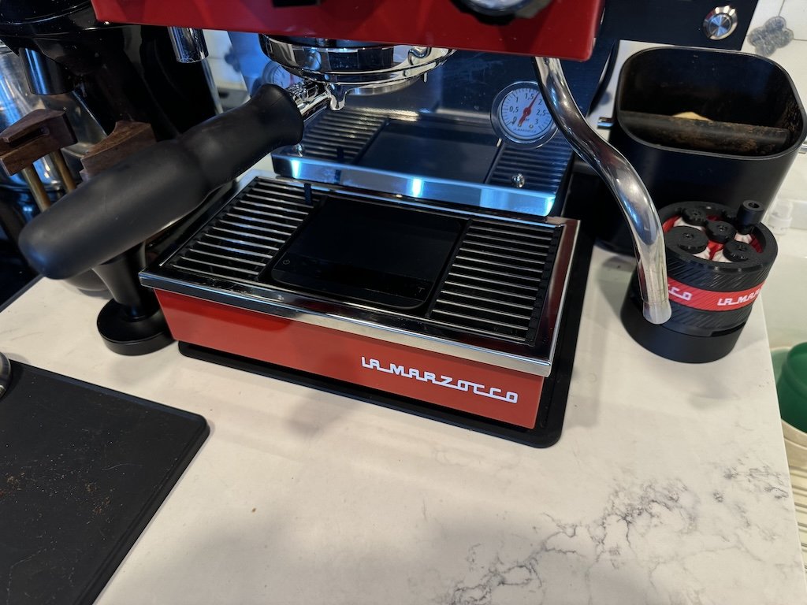
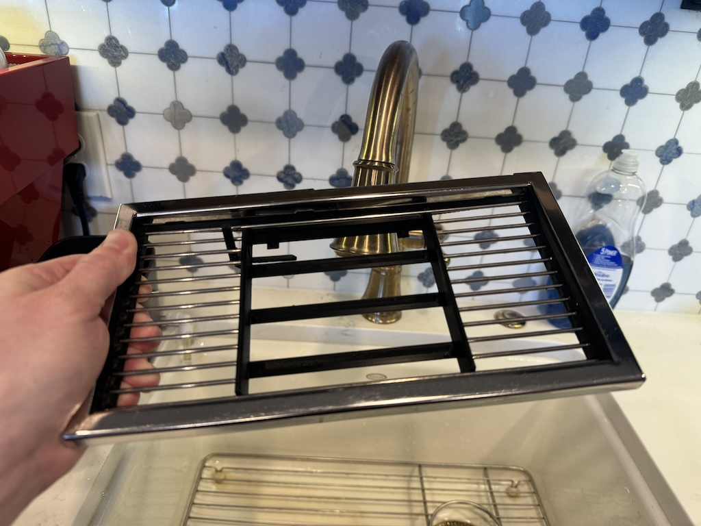
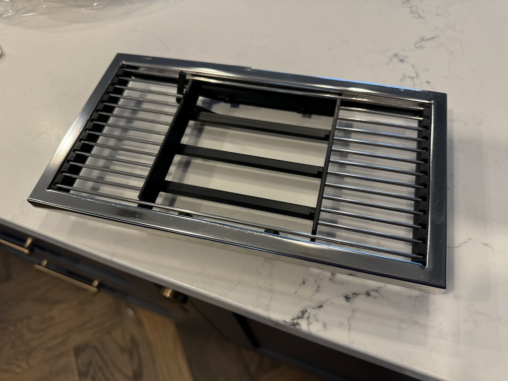

# Drain Tray Models

This folder contains three models for a recessed Acaia Lunar drip tray on the Micra. This includes a 1/2" NPT
connection that can be plugged with a standard 1/2" fitting if there is no plumbing. 

Your experience with this may vary depending on the quality of your resulting print and your experience in getting 
good results. These are advanced prints due to their size and the need to use higher temperature filament like ABS, ASA, 
or PC. Even with higher temp plastic, avoid shocking the tray with large amounts of boiling water or it can expand and 
crack if layers aren't strongly bonded. Along with the regular tricks for printing ABS, I would recommend printing with 
extra walls (6 or more) to increase strength, particularly around the NPT connection, and to avoid warping.  If your slicer 
supports ironing it is also nice to smooth the surfaces for easier cleaning. Your printer will need to be reliable in
printing supports, both the drip tray and the grille have overhang areas regardless of how they are printed.

There is a built-in tower to hold a float (work in progress).

The scale area is designed with a very slight tilt forward, to promote draining in a way that avoids
touch controls on the Lunar. There are detents to center the scale and keep it from touching the sides
of the recess, which can impact the scale measurements, these are designed to fit the scale without its
adhesive feet.

There is an optional lever that fits on the top left of the grille tray, which will help pop the scale out.

The grille piece comes in two sizes, one that is more flush to the top and one that drops the inside down 8mm. I designed
the recessed version to meet my needs and give me cup clearance for the largest to-go cups I use on occasion. Both will
fit in the same drip tray. These grilles require that you buy 2.5mm stainless rods and cut them to size (60mm and 234mm 
long), snapping them into the tray. I then took my original grille and removed the grille from the frame by taking a
dremel to the six weld points. This frame then snaps into the plastic grille and is friction fit - holds well but is
easily removable. The OEM part for the grille is `C.1.654` in case you want to buy another rather than destroy your 
original. These run about $100 as of now.

The drip tray installation is obvious once you remove the old drip tray from the metal frame. The original is held in
by two snap-ins at the rear that simply need to be pried out of the detents, and the front is attached with double sided 
tape. You can warm the front frame and use a guitar pick or similar to work the adhesive tape free, prying slowly and 
gently with patience.  The printed replacement drip tray just drops in and snaps in the rear, I didn't bother trying to
re-tape it thoroughly in front.

1. Drip tray
   
2. grille with recessed grate/scale (8mm recess)
   
3. grille with flush grate/scale
   

More photos:

